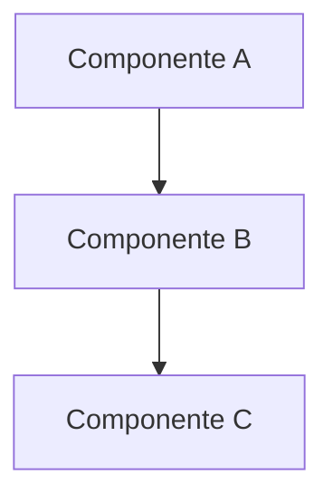
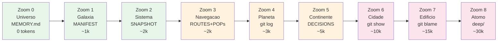

# GENOMA — Diagramas

> PGP (Protocolo GENOMA Perpetuo) v2.0

## Arquitetura — {{PROJECT_NAME}}

<!-- Substituir o diagrama acima pela arquitetura real do projeto -->

## Niveis de Zoom (Universo -> Atomo)

### Legenda dos Niveis

| Zoom | Nome | Fonte | Tokens | Quando usar |
|------|------|-------|--------|-------------|
| 0 | Universo | MEMORY.md | 0 | Auto-loaded toda sessao |
| 1 | Galaxia | MANIFEST.md | ~1k | Entender o projeto |
| 2 | Sistema | SNAPSHOT.md | ~2k | Estado atual |
| 3 | Navegacao | ROUTES + POPs | ~2k | Saber pra onde ir |
| 4 | Planeta | git log | ~3k | Timeline recente |
| 5 | Continente | DECISIONS.md | ~5k | Entender decisoes |
| 6 | Cidade | git show | ~10k | Detalhe de commit |
| 7 | Edificio | git blame | ~15k | Quem mudou o que |
| 8 | Atomo | deep/ | ~30k | Investigacao profunda |
